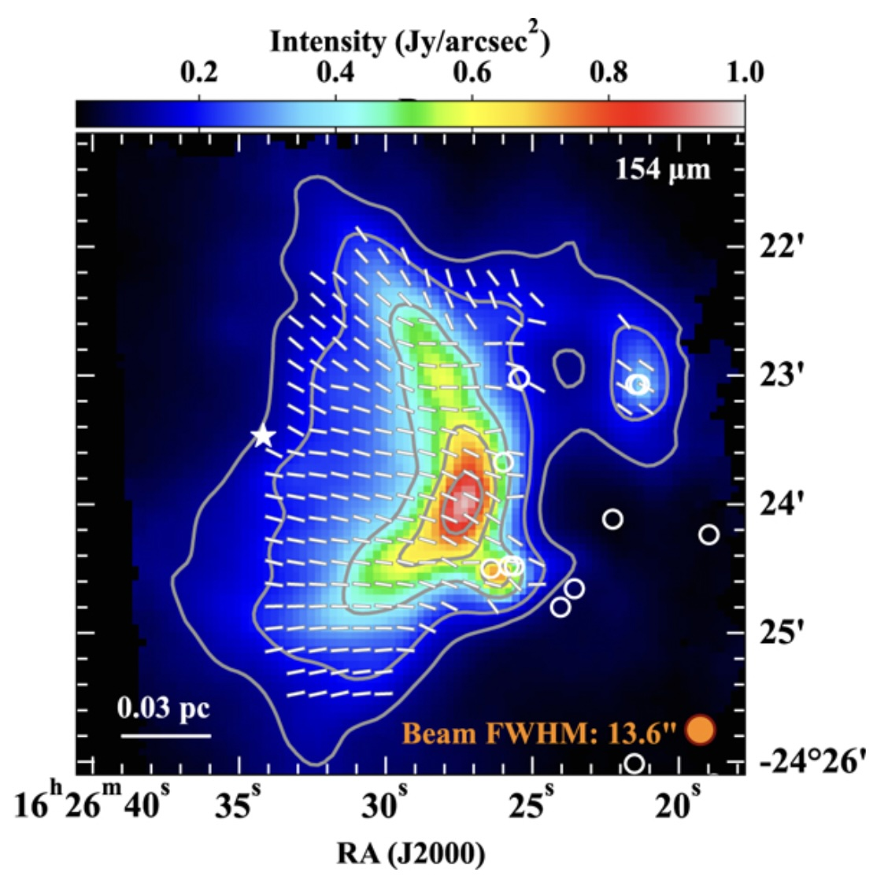
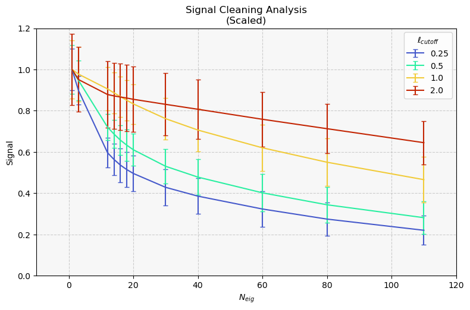

# ISGC 2025 - TolTEC
A collection of scripts and notebooks for undergraduate research in astronomical instrumentation in Summer 2025. This work was supported by the NASA Illinois Space Grant Consortium (ISGC) and the Northwestern Summer Undergraduate Research Grant (SURG) contributing to the [TolTEC](http://toltec.astro.umass.edu/science.php) research collaboration. TolTEC is an imaging polarimeter located on the Large Millimeter Telescope (LMT) operating at 1.1, 1.4, and 2.0 mm wavelengths. 

### Data Availability Disclaimer

The data referenced in this analysis are not included in this repository, as this work is part of an ongoing study that has not yet been published. In the meantime, this repository focuses on the methodology and general results, with individual reductions not presented as of yet.

## Scientific Motivation

Stars form in cold, dense pockets of gas and dust where matter is free to collapse into itself to initiate nuclear fusion with less resistance from the pressure of high temperatures. These regions of cold material are known as molecular clouds, and the mechanisms by which they begin to form stars are a topic of ongoing study. Various effects can both trigger and regulate star formation, with a critical area of research being the role of magnetic fields in supporting gas in opposition to gravitational collapse. In these regions, asymmetric interstellar dust grains align themselves such that their long axis is oriented perpendicular to field lines. They absorb and scatter starlight, re-emitting it at longer wavelengths with the electric field component preferentially aligned with the larger axis. As a result, by measuring the polarization angle and fraction of the light, astronomers are able to map out large scale magnetic fields.

Magnetic fields have been mapped out well at the large scale by instruments such as *Planck* and at smaller scales with interferometers like *ALMA*. However, there exists a gap in mapping the intermediate scales with enough resolution and coverage to adequately overlap observations of all different scales, necessary to determine how consistent magnetic fields remain over large ranges of spatial scale.

### Rho Ophiuchi A

$\rho$ Ophiuchi A is a nearby star-forming region located within the larger $\rho$ Ophiuchi molecular cloud complex, roughly 140 parsecs from Earth. Its proximity and youth make it a heavily studied site of active star formation, hosting a dense cluster of young stellar objects still embedded in gas and dust. The example map in *Figure 2* captured in the far infrared by the SOFIA/HAWC+ instrument illustrates magnetic field direction mapping of the molecular cloud.

<figure>
  
  <figcaption>Figure 2: Magnetic field lines and structure of Rho Oph A from Lê, et al. (2024).</figcaption>
</figure>

## Atmospheric Cleaning Signal Preservation

As is the case for images captured using optical telescopes as well as radio interferometers, data from large single-dish millimeter wavelength telescopes require significant processing in order to produce science ready results with sufficiently high signal to noise ratio (SNR). This is especially true for polarimetry, as the fraction of light from quasars, interstellar dust, and other objects that is polarized is very low. The primary source of noise for ground-based telescopes operating in the mm spectrum is the atmosphere, which absorbs orders of magnitude more millimeter light than visible light. Furthermore, water vapor emits light at millimeter wavelengths making it challenging to detect astrophysical sources over the noise. 

One method to help remedy the atmosphere's high opacity is to perform a scanning maneuver with the telescope such that the detectors view different regions of the map (image) over each 10s time chunk, essentially painting a picture over the array of highly sensitive detectors. The key assumption being leveraged is that the data associated with the largest spatial variance corresponds to the atmospheric low frequency noise, referred to as 1/f noise. The other notable source of uncertainty comes from the high frequency Gaussian, white, noise. Thus, in order to maximize SNR, we must remove the large uniform structures from the map that are not associated with the source.

This is where the widespread statistical technique of Principal Component Analysis (PCA) comes in. PCA is most often used to reduce the dimensionality of a dataset by identifying the components with the most spread and subtracting away the directions with the high or low variance. The atmospheric cleaning stage of the data reduction pipeline `citlali` takes time ordered data, decomposes it into its principal components (its eigenvectors) and removes the most N components with the highest spatial variance, with the hope that little of the true signal is stripped away in the process. While this works great for point sources like the quasar 3C286, it may present challenges when the source itself is extended as is the case for $\rho$ Oph A spanning ~5 arcminutes. My goal was to better understand the impact that the atmospheric cleaning algorithm has on both the signal and noise of a map, so that we can optimize the configuration of the reduction pipeline to preserve as much astrophysical signal as possible. While in theory we could easily remove nearly all atmospheric 1/f noise, the result would be a deconstructed mess of an image lacking extended spatial structure, the primary benefit contribution of a single dish instrument like the LMT. 

### My Approach

I ran dozens of reductions on maps varying a number of parameters, most importantly the number of eigenvalues, or components, removed during cleaning. Determining signal presented a difficulty because there was no "truth" image to compare to, so I used a lightly cleaned coadded map composed of multiple others to provide a high signal reference map to be compared with others. Then, I implemented a cross-correlation algorithm to precisely align images and get a baseline for how well they agree. As discussed in [Pointing](#pointing), maps varied in alignment and could not be directly superposed. Signal was hence determined using cross correlation and normalized for comparison.

Because PCA cleaning removes the largest structures first, it's useful to isolate these scales to see how they vary individually. I used a 2D Fourier Transform to manipulate the images in the frequency domain. For each spatial frequency, 0.25, 0.5, 1.0, and 2.0 $\text{arcmin}^{-1}$, I removed all scales smaller than it from the maps before calculating the signal. That way, I could examine the decay in signal corresponding to lower frequencies / larger scales. As seen in *Figure 1*, scales at and above 1 $\text{arcmin}$ are reduced to 80% after around 24 components are removed while scales at or above 4 $\text{arcmin}$ reach 80% at 5 components removed. By measuring this relationship, we're able to better balance signal and noise.

<figure>
  
  <figcaption>Figure 1: Cross correlated signal degradation as a function of the level of eigenvectors removed during atmospheric cleaning, scaled as a % of the signal without cleaning. Signal is stratified according to the low pass filter cutoff frequency.</figcaption>
</figure>

For noise, maps would similarly be precisely aligned before being subtracted from one another. Theoretically, observations taken at different times should have the same signal (to a scaling factor) with separate noise elements. Signal-less maps should include only noise, which can be characterized according to its spatial frequency by producing a Power Spectral Density plot, a tool for examining how much of each spatial scale is present. The right side corresponds to the highest frequencies like Gaussian noise while the left shows the low frequency large scale noise. Unfortunately, the isolation of true spatial noise is exceptionally difficult and many of the methods I used to remove the source such as isophotes, PCA, and z-score masking did not produce trustworthy enough results. While insights were gained from examining the relationships present in the sky noise, I focused most my attention on determining how signal is attenuated.

## Pointing

Observations are broken into separate maps taken in 20 minute exposures that are coadded together to boost SNR. In order to do this, precise positioning information must be found to ensure the structure remains intact and the averaging process doesn't blur it. The primary method for doing this is calibration observations on sources with well-known positions to tell the 50 m telescope exactly where it is before viewing science targets. The pipeline also performs several steps to line up maps, but it isn't perfect.

To correct pointing, I selected the Young Stellar Object VLA 1623 as a reference point at right-ascension $\text{16h 26m 26s}$ and declination $\text{-24}^{\circ}\text{ 24m 30s}$ . A flux cut was made to isolate the source before fitting a 2D Gaussian in order to determine the exact center. Then, the center was subtracted from the true coordinate to find the offset in the equatorial frame. `citlali` accepts pointing corrections in topocentric Az/El coordinates, so the transpose of the rotation matrix of the Parallactic Angle (PA) was used to convert to Az/El. Parallactic Angle is the angle subtending the North celestial pole and the local Zenith, meaning a rotation of PA about the line of sight can transform coordinates in either plane to the other, represented by the following rotation matrix.

$$ \begin{bmatrix} {\Delta Az} \\\\ {\Delta El} \end{bmatrix} = \begin{bmatrix} \cos (PA) & \sin (PA) \\\\ -\sin (PA) & \cos (PA) \end{bmatrix} \begin{bmatrix} {\Delta RA} \\\\ {\Delta DEC} \end{bmatrix} $$

As a result of these determined offsets I improved the pointing correction of citlali, recovering 11% more flux than prior coadded maps. 
 

## Feathering

Every astronomical instrument fulfills a different need. Larger diameter telescopes are capable of imaging at higher angular resolution, allowing the study of distant protoplanetary systems, black holes, ancient receding galaxies, and more. In the millimeter and radio wavelengths, the method of interferometry has been developed, utilizing dozens of individual telescopes to synthesize an image with resolutions as fine as 5 milliarcseconds. Astronomers are able to probe distant radio sources and learn about star forming regions invisible to optical telescopes. A cost of this is spatial scale, an area in which single dish observatories like the LMT excel. The natural question emerges of whether these strengths can be combined; they can, using a technique called feathering.

Feathering involves transforming single-dish images and interferometer data by first interpolating the two onto a common grid. They are then transformed to the spatial frequency domain where each is weighted according to its resolution to ensure proper preservation of spatial scale. Finally, they're combined and converted back to the spatial plane. It's a powerful tool, but can make calibrating scales challenging, so my implementation was largely a proof-of-concept rather than a practical result. It gave me the opportunity to learn about interferometry and use the CASA software, a powerful toolkit developed for the Atacama Large Millimeter Array (ALMA). Unfortunately, these preliminary results cannot be shown here due to the unreleased nature of the data.

## References

Golec, J.E., & TolTEC Collaboration (2024). Early high-resolution millimeter-wave maps from TolTEC. EPJ Web of Conferences, 293(2024), 00022. doi:https://doi.org/10.1051/epjconf/202429300022.

Lê, N., et al. (2024). Mapping and characterizing magnetic fields in the Rho Ophiuchus-A molecular cloud with SOFIA/HAWC+. Astronomy & Astrophysics, 690, A191. doi:https://doi.org/10.1051/0004-6361/202348008

McCrackan et al. (2022). The TolTEC camera: the citlali data reduction pipeline engine. Software and Cyberinfrastructure for Astronomy VII, 12189. doi:https://doi.org/10.1117/12.2629095

McCrackan, M.J. (2024). Development Of The Toltec Data Reduction Pipeline And The Application Of Hierarchical Bayesian Inference To Toltec Data. [Doctoral dissertation, University of Massachusetts Amherst]. Umass ScholarWorks. doi:https://doi.org/10.7275/54743

Wilson et al. (2020). The TolTEC camera: an overview of the instrument and in-lab testing results. Millimeter, Submillimeter, and Far-Infrared Detectors and Instrumentation for Astronomy X, 11453. doi:https://doi.org/10.1117/12.2562331

